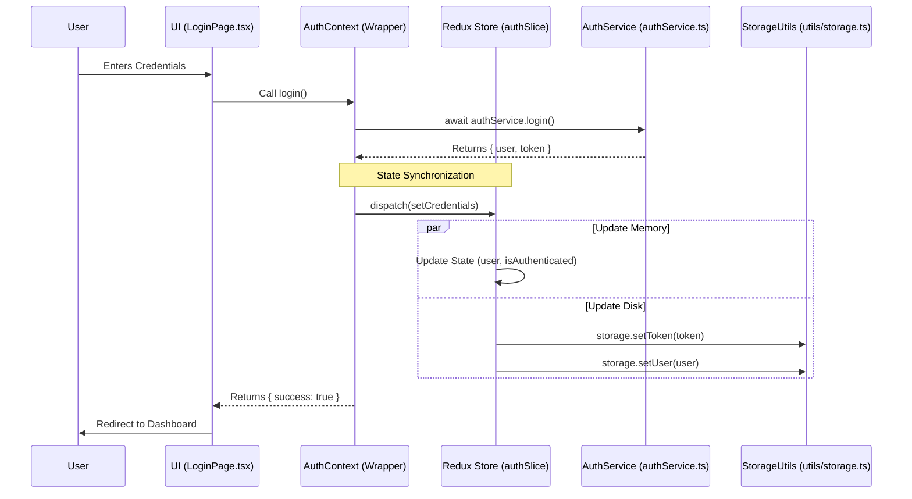

# Login Architecture & Data Flow (Redux Refactored)

This document outlines the authentication flow for the School Management System. It details how data moves from the User Interface to the Service layer, how it is stored securely via Redux, and how the application state is persisted.

## 1. High-Level Flow Diagram (Redux + Context)



## 2. Component Breakdown (The "Thin Wrapper" Pattern)

The system now uses a **Hybrid Architecture** that combines the simplicity of Context API with the power of Redux.

### A. The View Layer (`LoginPage.tsx`)
*   Remains unchanged. It consumes `useAuth()` to trigger login actions.

### B. The Context Wrapper (`AuthContext.tsx`)
*   **New Role:** Acts as an interface between UI and Redux.
*   **Mechanism:** Uses `useDispatch` to send actions to Redux and `useSelector` to read state.
*   **Benefit:** This allows us to keep the `useAuth()` hook throughout the app while benefiting from Redux performance.

### C. The State Engine (`authSlice.ts`)
*   **Role:** The **Single Source of Truth**.
*   **Persistence:** It is responsible for calling `StorageUtils` whenever state changes.
*   **Initialization:** It automatically reads from `localStorage` on boot to keep the user logged in.

### D. The Storage Utility (`src/utils/storage.ts`)
*   **Role:** Dedicated module for browser interaction.
*   **Security:** Handles JSON stringify/parse logic safely and centralizes key management.

---

## 3. Advantages of this Refactored Flow

1.  **Re-hydration:** Redux initializes its state immediately from `localStorage` before the first frame is even rendered.
2.  **Performance:** Reading user data now happens via Redux Selectors, which is faster than reading from disk (`localStorage.getItem`) repeatedly.
3.  **Consistency:** By moving persistence logic into the `authSlice`, we ensure that `localStorage` and `Redux State` are **always in sync**. It is impossible for one to change without the other.
4.  **Debugging:** You can now use **Redux DevTools** to see every login, logout, and token update in real-time.

---

## 4. Re-hydration Logic (App Start)

1.  Browser loads `main.tsx`.
2.  Redux Store is created.
3.  `authSlice` initializes `initialState`:
    ```typescript
    const initialState = {
      user: storage.getUser(), // Synchronous check
      token: storage.getToken(),
      isAuthenticated: storage.isAuthenticated()
    };
    ```
4.  `AuthContext` provides these values to the UI via `useSelector`.
5.  **Result:** The user is logged in instantly with zero flicker.
